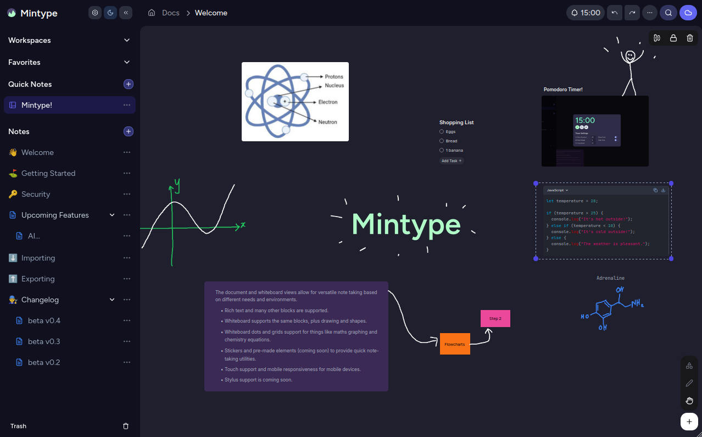

# Mintype - A free, zero-knowledge note taking app

## Available on all devices - Open Beta out now 🍏
This is a web-based app, so it is available on all devices that have browser support. I recommend Chrome and Firefox for best compatibility.

PWA support is built in to provide a more native feel, especially on **Android** and **iOS** devices. 
<!-- See installation instructions [here](https://docs.mintype.app/installation). -->

## Features
Mintype was a personal project to address some of my issues with current popular note taking apps. The app has grown to a state where I now feel it can be useful to others.

Mintype is free to use, and will remain free to use. Google Drive syncing is also free!

### Maximizing Privacy

Mintype has the following privacy features out of the box:

- All notes are encrypted on your device inside indexedDB.
- Notes can only be read after unlocking the app with your password. Your password is never stored anywhere.
- Notes are encrypted prior to saving to Google Drive.
- Additional feature to mark pages as sensitive, so your password is required again to view these pages. This is useful if you were to accidentally keep your device unattended.

  

### Offline first

Mintype can be used offline. No need to worry about needing internet to view your notes.

- The app is fully functional without internet
- Your changes will be queued for syncing when you are online again

### Dynamic Note-taking

The document and whiteboard views allow for versatile note taking based on different needs and environments.

- Rich text and many other blocks are supported.
- Whiteboard supports the same blocks, plus drawing and shapes.
- Whiteboard backgrounds, dots and grids support for things like maths graphing and chemistry equations.
- Stickers and pre-made elements (coming soon) to provide quick note-taking utilities.
- Touch support and mobile responsiveness for mobile devices.
- Stylus support (coming soon).

  

### Built for a simple user experience

Mintype is built with a very familiar file structure, organization heirarchy and minimal bloat. The goal is to get on with your note-taking without getting lost in features or complex UI. The mobile experience is also a top priority during development.

- A simple workspace > page > nested page hierarchy.
- Quick notes section to take notes on the go, and organize later.
- Note organization utilities are built in, such as moving pages between workspaces, drag and drop to reorder, trashed folder and favorites.
- Light and dark mode support is also built in.
- Mobile app does not sacrifice any features, and has a very similair UX to desktop.
- Very straightforward search feature (will be built out more with tags and filter options soon)

  

## Is it available on MacOS / Linux / Android?

Yes, Mintype is available on all devices with a browser. We recommend Chrome and Firefox on desktop. On Android I recommend Chrome for its PWA support. On iOS I recommend Safari for its PWA support.

## Is syncing free? Is it secure?

Yes, Mintype uses Google Drive as its sync mechanism free of charge. It runs completely client side (your notes do not go through our servers), and all your notes are encrypted client side prior to reaching any of Google's APIs. You can view you notes on Drive yourself and see that they are stored as ciphertext.

## Who can view my notes?

Only you can decipher your notes. They are encrypted with your password and stored on your device and in Google Drive (optional). We do not store your password anywhere, not even on your device. Mintype does not store your notes in our databases either.

## Do you collect any data?

There are no trackers or any other integrations in Mintype other that Supabase for authentication and Google APIs for drive sync. If you create an account, we do store your email and encrypted copies of your keys for authentication services and easy sign in on new a new device. Your email is not shared with any third parties.

## Will Mintype become open source?

This project is planned to be fully open source soon. For now, all code involved in saving notes, syncing and secure storage are relased for auditing purposes. Please note that in its current state, this project will NOT build. I am not accepting dedicated contributors as of now, but you are welcome to provide feature requests and bug fixes via Github issues and in-app feedback.

## Are native iOS, Android and Desktop (Electron) apps planned?

An ElectronJS desktop version is planned, it will have the extra benefit of saving notes directly to disk (instead of indexedDB). This allows you to have your own sync mechanisms such as git repositories, one drive, syncthing etc... to sync and backup your notes.

Mobile native apps are currently not planned. However they are likely given enough mobile native APIs become necessary.

## Are there any paid features?

As of now there is none. I do plan to add a store later on which can contain items like page templates and pre-made elements to improve the note-taking experience. These will be a small price. The community is welcome to submit these templates/designs to us to support development. Mintype is a completely self funded project. Other features like AI, OCR etc which require compute will also be paid if ever added. These will not be under a subscription however, but a pay as needed basis. I will not add subscriptions to Mintype.

## How can i get in touch / submit issues?

Follow for app updates here:

- [Github](https://github.com/project59/mintype)
- [Github Issues](https://github.com/project59/mintype/issues)
- [Roadmap](https://github.com/orgs/project59/projects/1)
- [Community Forums](https://community.mintype.app/discussions)

## Star History

<a href="https://www.star-history.com/#project59/mintype&type=date&legend=bottom-right">
 <picture>
   <source media="(prefers-color-scheme: dark)" srcset="https://api.star-history.com/svg?repos=project59/mintype&type=date&theme=dark&legend=bottom-right" />
   <source media="(prefers-color-scheme: light)" srcset="https://api.star-history.com/svg?repos=project59/mintype&type=date&legend=bottom-right" />
   
 </picture>
</a>

